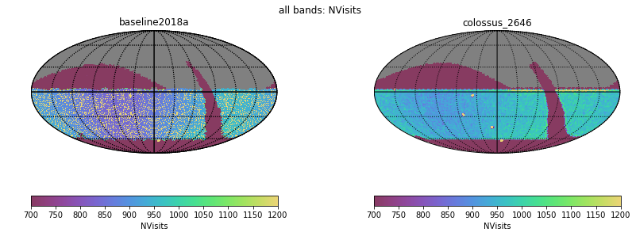
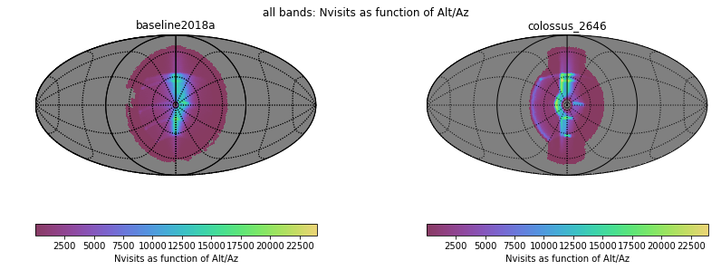
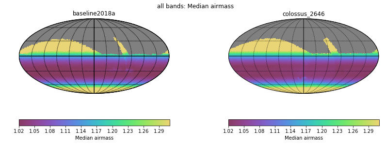
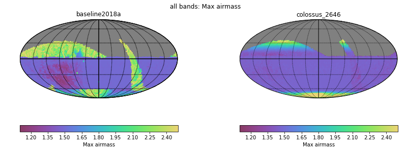
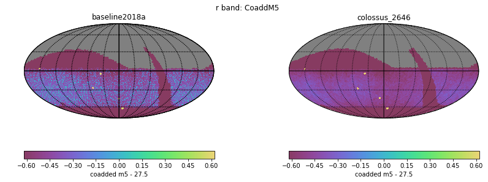
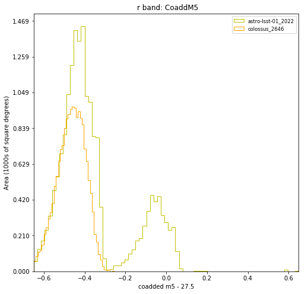
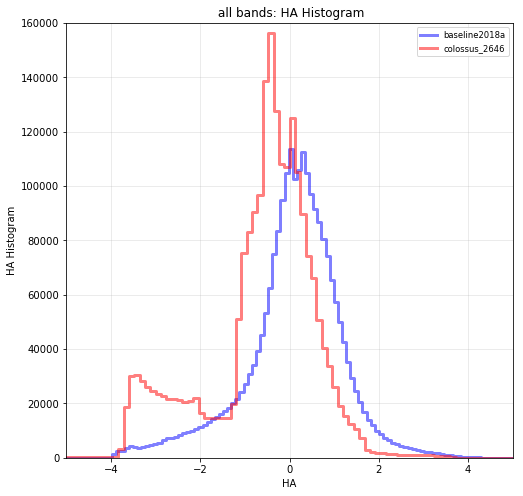
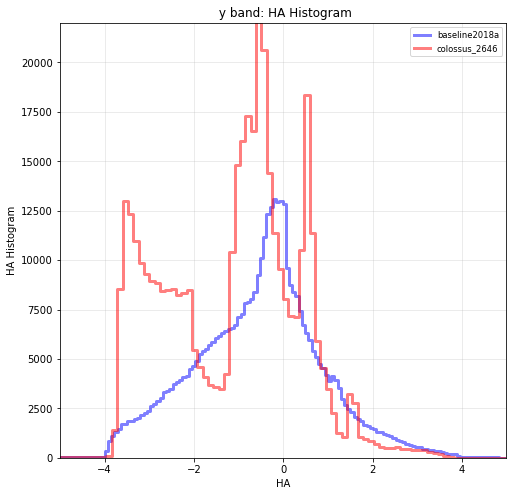
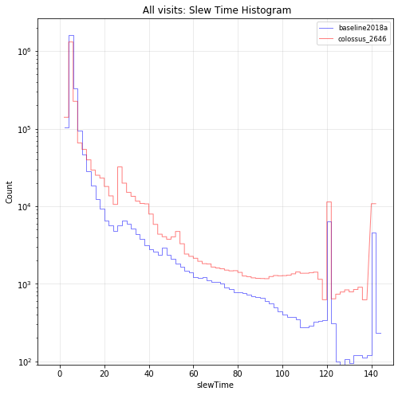
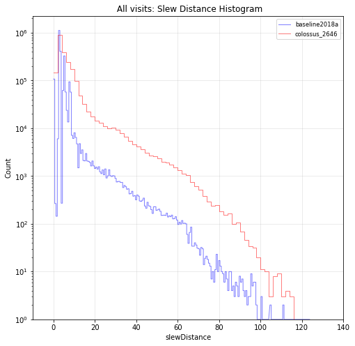

# fO Metrics

<table border="1" class="dataframe">
  <thead>
    <tr style="text-align: right;">
      <th></th>
      <th>baseline2018a</th>
      <th>colossus_2646</th>
    </tr>
  </thead>
  <tbody>
    <tr>
      <th>fOArea: Nvisits (#) fO All visits HealpixSlicer</th>
      <td>836.000000</td>
      <td>709.000000</td>
    </tr>
    <tr>
      <th>fOArea: Nvisits/benchmark fO All visits HealpixSlicer</th>
      <td>1.013333</td>
      <td>0.859394</td>
    </tr>
    <tr>
      <th>fONv: Area (sqdeg) fO All visits HealpixSlicer</th>
      <td>18056.563483</td>
      <td>17738.471192</td>
    </tr>
    <tr>
      <th>fONv: Area/benchmark fO All visits HealpixSlicer</th>
      <td>1.003142</td>
      <td>0.985471</td>
    </tr>
    <tr>
      <th>fOArea: Nvisits (#) fO WFD HealpixSlicer</th>
      <td>835.000000</td>
      <td>432.000000</td>
    </tr>
    <tr>
      <th>fOArea: Nvisits/benchmark fO WFD HealpixSlicer</th>
      <td>1.012121</td>
      <td>0.523636</td>
    </tr>
    <tr>
      <th>fONv: Area (sqdeg) fO WFD HealpixSlicer</th>
      <td>18040.616904</td>
      <td>17260.913107</td>
    </tr>
    <tr>
      <th>fONv: Area/benchmark fO WFD HealpixSlicer</th>
      <td>1.002256</td>
      <td>0.958940</td>
    </tr>
  </tbody>
</table>

# Parallax

<table border="1" class="dataframe">
  <thead>
    <tr style="text-align: right;">
      <th></th>
      <th>baseline2018a</th>
      <th>colossus_2646</th>
    </tr>
  </thead>
  <tbody>
    <tr>
      <th>Median Parallax Error @ 24.0 All visits HealpixSlicer</th>
      <td>7.211897</td>
      <td>7.410334</td>
    </tr>
    <tr>
      <th>Median Parallax Coverage @ 24.0 All visits HealpixSlicer</th>
      <td>0.540989</td>
      <td>0.575772</td>
    </tr>
    <tr>
      <th>Median Parallax-DCR degeneracy @ 24.0 All visits HealpixSlicer</th>
      <td>0.213722</td>
      <td>0.277398</td>
    </tr>
    <tr>
      <th>Median Parallax Error @ 24.0 WFD HealpixSlicer</th>
      <td>6.320265</td>
      <td>6.680559</td>
    </tr>
    <tr>
      <th>Median Parallax Coverage @ 24.0 WFD HealpixSlicer</th>
      <td>0.543600</td>
      <td>0.598591</td>
    </tr>
    <tr>
      <th>Median Parallax-DCR degeneracy @ 24.0 WFD HealpixSlicer</th>
      <td>0.165450</td>
      <td>0.298203</td>
    </tr>
    <tr>
      <th>Median Parallax Error @ 22.4 All visits HealpixSlicer</th>
      <td>1.848632</td>
      <td>1.879195</td>
    </tr>
    <tr>
      <th>Median Parallax Coverage @ 22.4 All visits HealpixSlicer</th>
      <td>0.547516</td>
      <td>0.584661</td>
    </tr>
    <tr>
      <th>Median Parallax-DCR degeneracy @ 22.4 All visits HealpixSlicer</th>
      <td>0.219225</td>
      <td>0.285838</td>
    </tr>
    <tr>
      <th>Median Parallax Error @ 22.4 WFD HealpixSlicer</th>
      <td>1.637874</td>
      <td>1.711611</td>
    </tr>
    <tr>
      <th>Median Parallax Coverage @ 22.4 WFD HealpixSlicer</th>
      <td>0.549357</td>
      <td>0.606619</td>
    </tr>
    <tr>
      <th>Median Parallax-DCR degeneracy @ 22.4 WFD HealpixSlicer</th>
      <td>0.172049</td>
      <td>0.309513</td>
    </tr>
  </tbody>
</table>

# Proper motion

<table border="1" class="dataframe">
  <thead>
    <tr style="text-align: right;">
      <th></th>
      <th>baseline2018a</th>
      <th>colossus_2646</th>
    </tr>
  </thead>
  <tbody>
    <tr>
      <th>Median Proper Motion Error @ 24.0 All visits HealpixSlicer</th>
      <td>1.850232</td>
      <td>1.840257</td>
    </tr>
    <tr>
      <th>Median Proper Motion Error @ 24.0 WFD HealpixSlicer</th>
      <td>1.712652</td>
      <td>1.730705</td>
    </tr>
    <tr>
      <th>Median Proper Motion Error @ 20.5 All visits HealpixSlicer</th>
      <td>0.173208</td>
      <td>0.169556</td>
    </tr>
    <tr>
      <th>Median Proper Motion Error @ 20.5 WFD HealpixSlicer</th>
      <td>0.169005</td>
      <td>0.166064</td>
    </tr>
  </tbody>
</table>

# Rapid revisit

<table border="1" class="dataframe">
  <thead>
    <tr style="text-align: right;">
      <th></th>
      <th>baseline2018a</th>
      <th>colossus_2646</th>
    </tr>
  </thead>
  <tbody>
    <tr>
      <th>Area (sq deg) Number of revisits faster than 30.0 minutes All visits HealpixSlicer</th>
      <td>5834.756474</td>
      <td>69.747328</td>
    </tr>
    <tr>
      <th>Area (sq deg) Number of revisits faster than 30.0 minutes WFD HealpixSlicer</th>
      <td>8340.794119</td>
      <td>0.000000</td>
    </tr>
  </tbody>
</table>

# Fraction in pairs

<table border="1" class="dataframe">
  <thead>
    <tr style="text-align: right;">
      <th></th>
      <th>baseline2018a</th>
      <th>colossus_2646</th>
    </tr>
  </thead>
  <tbody>
    <tr>
      <th>Median Fraction of visits in pairs (15-60 min) gri HealpixSlicer</th>
      <td>0.894621</td>
      <td>0.716654</td>
    </tr>
    <tr>
      <th>Median Fraction of visits in pairs (15-60 min) gri WFD+NES HealpixSlicer</th>
      <td>0.901468</td>
      <td>0.760396</td>
    </tr>
  </tbody>
</table>

# Fraction of Total visits per proposal

<table border="1" class="dataframe">
  <thead>
    <tr style="text-align: right;">
      <th></th>
      <th>baseline2018a</th>
      <th>colossus_2646</th>
    </tr>
  </thead>
  <tbody>
    <tr>
      <th>Fraction of total Nvisits All props</th>
      <td>1.000000</td>
      <td>1.000000</td>
    </tr>
    <tr>
      <th>Fraction of total Nvisits SouthCelestialPole</th>
      <td>0.019821</td>
      <td>0.029253</td>
    </tr>
    <tr>
      <th>Fraction of total Nvisits WideFastDeep</th>
      <td>0.863711</td>
      <td>0.815402</td>
    </tr>
    <tr>
      <th>Fraction of total Nvisits DeepDrillingCosmology1</th>
      <td>0.045935</td>
      <td>0.068046</td>
    </tr>
    <tr>
      <th>Fraction of total Nvisits GalacticPlane</th>
      <td>0.016270</td>
      <td>0.019115</td>
    </tr>
    <tr>
      <th>Fraction of total Nvisits NorthEclipticSpur</th>
      <td>0.054521</td>
      <td>0.068185</td>
    </tr>
  </tbody>
</table>

# Median Nvsits per filter WFD

<table border="1" class="dataframe">
  <thead>
    <tr style="text-align: right;">
      <th></th>
      <th>baseline2018a</th>
      <th>colossus_2646</th>
    </tr>
  </thead>
  <tbody>
    <tr>
      <th>Median NVisits WFD u band HealpixSlicer</th>
      <td>62.0</td>
      <td>67.0</td>
    </tr>
    <tr>
      <th>Median NVisits WFD i band HealpixSlicer</th>
      <td>199.0</td>
      <td>204.0</td>
    </tr>
    <tr>
      <th>Median NVisits WFD r band HealpixSlicer</th>
      <td>200.0</td>
      <td>204.0</td>
    </tr>
    <tr>
      <th>Median NVisits WFD g band HealpixSlicer</th>
      <td>87.0</td>
      <td>92.0</td>
    </tr>
    <tr>
      <th>Median NVisits WFD all bands HealpixSlicer</th>
      <td>912.0</td>
      <td>946.0</td>
    </tr>
    <tr>
      <th>Median NVisits WFD z band HealpixSlicer</th>
      <td>183.0</td>
      <td>186.0</td>
    </tr>
    <tr>
      <th>Median NVisits WFD y band HealpixSlicer</th>
      <td>182.0</td>
      <td>192.0</td>
    </tr>
  </tbody>
</table>

# Median CoaddedM5 per filter WFD

<table border="1" class="dataframe">
  <thead>
    <tr style="text-align: right;">
      <th></th>
      <th>baseline2018a</th>
      <th>colossus_2646</th>
    </tr>
  </thead>
  <tbody>
    <tr>
      <th>Median CoaddM5 WFD u band HealpixSlicer</th>
      <td>25.615042</td>
      <td>25.644178</td>
    </tr>
    <tr>
      <th>Median CoaddM5 WFD i band HealpixSlicer</th>
      <td>26.613175</td>
      <td>26.526201</td>
    </tr>
    <tr>
      <th>Median CoaddM5 WFD r band HealpixSlicer</th>
      <td>27.187683</td>
      <td>27.129955</td>
    </tr>
    <tr>
      <th>Median CoaddM5 WFD g band HealpixSlicer</th>
      <td>27.110218</td>
      <td>27.149279</td>
    </tr>
    <tr>
      <th>Median CoaddM5 WFD z band HealpixSlicer</th>
      <td>25.706837</td>
      <td>25.808272</td>
    </tr>
    <tr>
      <th>Median CoaddM5 WFD y band HealpixSlicer</th>
      <td>24.892254</td>
      <td>24.815838</td>
    </tr>
  </tbody>
</table>

# Median seeingEff per filter WFD

<table border="1" class="dataframe">
  <thead>
    <tr style="text-align: right;">
      <th></th>
      <th>baseline2018a</th>
      <th>colossus_2646</th>
    </tr>
  </thead>
  <tbody>
    <tr>
      <th>Median Median seeingEff WFD u band HealpixSlicer</th>
      <td>0.955978</td>
      <td>0.948973</td>
    </tr>
    <tr>
      <th>Median Median seeingEff WFD i band HealpixSlicer</th>
      <td>0.823022</td>
      <td>0.844026</td>
    </tr>
    <tr>
      <th>Median Median seeingEff WFD r band HealpixSlicer</th>
      <td>0.849100</td>
      <td>0.863123</td>
    </tr>
    <tr>
      <th>Median Median seeingEff WFD g band HealpixSlicer</th>
      <td>0.905754</td>
      <td>0.895287</td>
    </tr>
    <tr>
      <th>Median Median seeingEff WFD all bands HealpixSlicer</th>
      <td>0.836284</td>
      <td>0.855962</td>
    </tr>
    <tr>
      <th>Median Median seeingEff WFD z band HealpixSlicer</th>
      <td>0.815861</td>
      <td>0.829391</td>
    </tr>
    <tr>
      <th>Median Median seeingEff WFD y band HealpixSlicer</th>
      <td>0.805565</td>
      <td>0.837281</td>
    </tr>
  </tbody>
</table>

# Slew statistics

<table border="1" class="dataframe">
  <thead>
    <tr style="text-align: right;">
      <th></th>
      <th>baseline2018a</th>
      <th>colossus_2646</th>
    </tr>
  </thead>
  <tbody>
    <tr>
      <th>Mean slewTime All visits</th>
      <td>7.919872</td>
      <td>11.638055</td>
    </tr>
    <tr>
      <th>Median slewTime All visits</th>
      <td>5.174937</td>
      <td>5.412055</td>
    </tr>
    <tr>
      <th>Min slewTime All visits</th>
      <td>2.000000</td>
      <td>2.000000</td>
    </tr>
    <tr>
      <th>Max slewTime All visits</th>
      <td>142.999591</td>
      <td>140.000000</td>
    </tr>
  </tbody>
</table>

# Filter change statistics

<table border="1" class="dataframe">
  <thead>
    <tr style="text-align: right;">
      <th></th>
      <th>baseline2018a</th>
      <th>colossus_2646</th>
    </tr>
  </thead>
  <tbody>
    <tr>
      <th>Filter Changes Whole Survey</th>
      <td>10644.000000</td>
      <td>21508.000000</td>
    </tr>
    <tr>
      <th>Filter Changes Per Night OneDSlicer</th>
      <td>3025.000000</td>
      <td>3025.000000</td>
    </tr>
    <tr>
      <th>Max Filter Changes Per Night OneDSlicer</th>
      <td>23.000000</td>
      <td>26.000000</td>
    </tr>
    <tr>
      <th>Mean Filter Changes Per Night OneDSlicer</th>
      <td>3.134876</td>
      <td>6.128264</td>
    </tr>
    <tr>
      <th>Median Filter Changes Per Night OneDSlicer</th>
      <td>2.000000</td>
      <td>5.000000</td>
    </tr>
    <tr>
      <th>Min Filter Changes Per Night OneDSlicer</th>
      <td>0.000000</td>
      <td>0.000000</td>
    </tr>
    <tr>
      <th>N(+3Sigma) Filter Changes Per Night OneDSlicer</th>
      <td>59.000000</td>
      <td>80.000000</td>
    </tr>
    <tr>
      <th>N(-3Sigma) Filter Changes Per Night OneDSlicer</th>
      <td>0.000000</td>
      <td>0.000000</td>
    </tr>
    <tr>
      <th>Rms Filter Changes Per Night OneDSlicer</th>
      <td>3.471012</td>
      <td>4.873074</td>
    </tr>
  </tbody>
</table>

# Normalized effective time

<table border="1" class="dataframe">
  <thead>
    <tr style="text-align: right;">
      <th></th>
      <th>baseline2018a</th>
      <th>colossus_2646</th>
    </tr>
  </thead>
  <tbody>
    <tr>
      <th>Normalized Teff all bands</th>
      <td>0.558197</td>
      <td>0.531212</td>
    </tr>
    <tr>
      <th>Max Normalized Teff all bands HealpixSlicer</th>
      <td>0.735635</td>
      <td>0.959036</td>
    </tr>
    <tr>
      <th>Mean Normalized Teff all bands HealpixSlicer</th>
      <td>0.502386</td>
      <td>0.487929</td>
    </tr>
    <tr>
      <th>Median Normalized Teff all bands HealpixSlicer</th>
      <td>0.545690</td>
      <td>0.516255</td>
    </tr>
    <tr>
      <th>Min Normalized Teff all bands HealpixSlicer</th>
      <td>0.073872</td>
      <td>0.058435</td>
    </tr>
    <tr>
      <th>N(+3Sigma) Normalized Teff all bands HealpixSlicer</th>
      <td>0.000000</td>
      <td>1.000000</td>
    </tr>
    <tr>
      <th>N(-3Sigma) Normalized Teff all bands HealpixSlicer</th>
      <td>0.000000</td>
      <td>15.000000</td>
    </tr>
    <tr>
      <th>Normalized Teff all bands HealpixSlicer</th>
      <td>31116.000000</td>
      <td>31939.000000</td>
    </tr>
    <tr>
      <th>Rms Normalized Teff all bands HealpixSlicer</th>
      <td>0.146207</td>
      <td>0.133986</td>
    </tr>
  </tbody>
</table>

# Open shutter fraction

<table border="1" class="dataframe">
  <thead>
    <tr style="text-align: right;">
      <th></th>
      <th>baseline2018a</th>
      <th>colossus_2646</th>
    </tr>
  </thead>
  <tbody>
    <tr>
      <th>OpenShutterFraction All visits</th>
      <td>0.715651</td>
      <td>0.657346</td>
    </tr>
    <tr>
      <th>Max OpenShutterFraction Per night OneDSlicer</th>
      <td>0.765440</td>
      <td>0.734834</td>
    </tr>
    <tr>
      <th>Mean OpenShutterFraction Per night OneDSlicer</th>
      <td>0.715703</td>
      <td>0.657944</td>
    </tr>
    <tr>
      <th>Median OpenShutterFraction Per night OneDSlicer</th>
      <td>0.718118</td>
      <td>0.658031</td>
    </tr>
    <tr>
      <th>Min OpenShutterFraction Per night OneDSlicer</th>
      <td>0.601392</td>
      <td>0.583334</td>
    </tr>
    <tr>
      <th>N(+3Sigma) OpenShutterFraction Per night OneDSlicer</th>
      <td>0.000000</td>
      <td>0.000000</td>
    </tr>
    <tr>
      <th>N(-3Sigma) OpenShutterFraction Per night OneDSlicer</th>
      <td>22.000000</td>
      <td>0.000000</td>
    </tr>
    <tr>
      <th>OpenShutterFraction Per night OneDSlicer</th>
      <td>3025.000000</td>
      <td>3025.000000</td>
    </tr>
    <tr>
      <th>Rms OpenShutterFraction Per night OneDSlicer</th>
      <td>0.021834</td>
      <td>0.025913</td>
    </tr>
  </tbody>
</table>

# HealpixSkyMaps
 - Nvisits all bands
 - Nvisits alt/az all bands
 - Median airmass all bands
 - Max airmass all bands
 - CoaddM5 r band

# CoaddM5 r band HealpixHistrogram

# HA distributions (OneDSlicer)

# HA distribution all bands

# HA distribution y band

# Slew time and distance distributions

