# Table of Contents
1. [fO](#fo)
2. [Total Effective Time](#total-effective-time)
3. [Normalized Effective Time](#normalized-effective-time)
4. [Open Shutter Fraction](#open-shutter-fraction)
5. [Parallax](#parallax)
6. [Proper Motion](#proper-motion)
7. [Rapid Revisit](#rapid-revisit)
8. [Fraction in Paris](#fraction-in-paris)
9. [Slews](#slews)
10. [Filter Changes](#filter-changes)
11. [Nvisits](#nvisits)
12. [Proposal Fractions](#proposal-fractions)
13. [Median Nvisits WFD](#median-nvisits-wfd)
14. [Median CoaddM5 WFD](#median-coaddm5-wfd)
15. [Median Airmass WFD](#median-airmass-wfd)
16. [Median Seeing WFD](#median-seeing-wfd)
17. [Skymap comparisons](#skymap-comparisons)
18. [Histrogram comparisons](#histrogram-comparisons)
# fO
|                                                       |   kraken_2026 |   nexus_2089 |
|:------------------------------------------------------|--------------:|-------------:|
| fOArea: Nvisits (#) fO All visits HealpixSlicer       |       857     |      770     |
| fOArea: Nvisits/benchmark fO All visits HealpixSlicer |         1.039 |        0.933 |
| fONv: Area (sqdeg) fO All visits HealpixSlicer        |     18056.6   |    17918.1   |
| fONv: Area/benchmark fO All visits HealpixSlicer      |         1.003 |        0.995 |
| fOArea: Nvisits (#) fO WFD HealpixSlicer              |       857     |      530     |
| fOArea: Nvisits/benchmark fO WFD HealpixSlicer        |         1.039 |        0.642 |
| fONv: Area (sqdeg) fO WFD HealpixSlicer               |     18040.6   |    17512.7   |
| fONv: Area/benchmark fO WFD HealpixSlicer             |         1.002 |        0.973 |

# Total Effective Time
|                          |   kraken_2026 |   nexus_2089 |
|:-------------------------|--------------:|-------------:|
| Total Teff all bands     |   4.08386e+07 |  4.28424e+07 |
| Total Teff WFD all bands |   3.68931e+07 |  3.72547e+07 |

# Normalized Effective Time
|                                                    |   kraken_2026 |   nexus_2089 |
|:---------------------------------------------------|--------------:|-------------:|
| Normalized Teff WFD all bands                      |         0.584 |        0.614 |
| Median Normalized Teff WFD all bands HealpixSlicer |         0.584 |        0.622 |
| Normalized Teff WFD all bands HealpixSlicer        |     21495     |    22907     |

# Open Shutter Fraction
|                                                 |   kraken_2026 |   nexus_2089 |
|:------------------------------------------------|--------------:|-------------:|
| OpenShutterFraction All visits                  |         0.735 |        0.74  |
| Median OpenShutterFraction Per night OneDSlicer |         0.739 |        0.741 |
| OpenShutterFraction Per night OneDSlicer        |      3025     |     3025     |

# Parallax
|                                                                |   kraken_2026 |   nexus_2089 |
|:---------------------------------------------------------------|--------------:|-------------:|
| Median Parallax Error @ 22.4 All visits HealpixSlicer          |         1.816 |        2.024 |
| Median Parallax Error @ 24.0 All visits HealpixSlicer          |         7.066 |        8.041 |
| Median Parallax Coverage @ 22.4 All visits HealpixSlicer       |         0.555 |        0.564 |
| Median Parallax Coverage @ 24.0 All visits HealpixSlicer       |         0.551 |        0.558 |
| Median Parallax-DCR degeneracy @ 22.4 All visits HealpixSlicer |         0.237 |        0.219 |
| Median Parallax-DCR degeneracy @ 24.0 All visits HealpixSlicer |         0.235 |        0.212 |
| Median Parallax Error @ 22.4 WFD HealpixSlicer                 |         1.606 |        1.885 |
| Median Parallax Error @ 24.0 WFD HealpixSlicer                 |         6.175 |        7.445 |
| Median Parallax Coverage @ 22.4 WFD HealpixSlicer              |         0.559 |        0.571 |
| Median Parallax Coverage @ 24.0 WFD HealpixSlicer              |         0.555 |        0.565 |
| Median Parallax-DCR degeneracy @ 22.4 WFD HealpixSlicer        |         0.175 |        0.187 |
| Median Parallax-DCR degeneracy @ 24.0 WFD HealpixSlicer        |         0.172 |        0.177 |

# Proper Motion
|                                                            |   kraken_2026 |   nexus_2089 |
|:-----------------------------------------------------------|--------------:|-------------:|
| Median Proper Motion Error @ 20.5 All visits HealpixSlicer |         0.17  |        0.172 |
| Median Proper Motion Error @ 24.0 All visits HealpixSlicer |         1.813 |        2.062 |
| Median Proper Motion Error @ 20.5 WFD HealpixSlicer        |         0.166 |        0.167 |
| Median Proper Motion Error @ 24.0 WFD HealpixSlicer        |         1.677 |        1.927 |

# Rapid Revisit
|                                                      |   kraken_2026 |   nexus_2089 |
|:-----------------------------------------------------|--------------:|-------------:|
| Area (sq deg) RapidRevisits All visits HealpixSlicer |       10178   |      26997.1 |
| Median RapidRevisits All visits HealpixSlicer        |           0   |          1   |
| RapidRevisits All visits HealpixSlicer               |       31116   |      31924   |
| Area (sq deg) RapidRevisits WFD HealpixSlicer        |       10757.1 |      36534.6 |
| Median RapidRevisits WFD HealpixSlicer               |           0   |          1   |
| RapidRevisits WFD HealpixSlicer                      |       21495   |      22907   |

# Fraction in Paris
|                                                                          |   kraken_2026 |   nexus_2089 |
|:-------------------------------------------------------------------------|--------------:|-------------:|
| Median Fraction of visits in pairs (15-60 min) gri WFD+NES HealpixSlicer |         0.876 |        0.862 |
| Median Fraction of visits in pairs (15-60 min) gri HealpixSlicer         |         0.868 |        0.847 |

# Slews
|                            |   kraken_2026 |   nexus_2089 |
|:---------------------------|--------------:|-------------:|
| Mean slewTime All visits   |         6.789 |        6.567 |
| Median slewTime All visits |         4.792 |        4.862 |
| Min slewTime All visits    |         2     |        2     |
| Max slewTime All visits    |       156     |      140     |

# Filter Changes
|                                                |   kraken_2026 |   nexus_2089 |
|:-----------------------------------------------|--------------:|-------------:|
| Filter Changes Whole Survey                    |     10813     |    12039     |
| Filter Changes Per Night OneDSlicer            |      3025     |     3025     |
| Max Filter Changes Per Night OneDSlicer        |        24     |        9     |
| Mean Filter Changes Per Night OneDSlicer       |         3.177 |        3.108 |
| Median Filter Changes Per Night OneDSlicer     |         2     |        3     |
| Min Filter Changes Per Night OneDSlicer        |         0     |        0     |
| N(+3Sigma) Filter Changes Per Night OneDSlicer |        68     |        0     |
| N(-3Sigma) Filter Changes Per Night OneDSlicer |         0     |        0     |
| Rms Filter Changes Per Night OneDSlicer        |         3.578 |        2.187 |

# Nvisits
|                                     |    kraken_2026 |     nexus_2089 |
|:------------------------------------|---------------:|---------------:|
| Fraction of total Nvisits All props |    1           |    1           |
| Nvisits All props                   |    2.43839e+06 |    2.46008e+06 |
| Median Nvisits All props OneDSlicer |  806           |  815           |
| Nvisits All props OneDSlicer        | 3025           | 3025           |

# Proposal Fractions
|                                                  |   kraken_2026 |   nexus_2089 |
|:-------------------------------------------------|--------------:|-------------:|
| Fraction of total Nvisits All props              |         1     |        1     |
| Fraction of total Nvisits GalacticPlane          |         0.016 |        0.031 |
| Fraction of total Nvisits WideFastDeep           |         0.864 |        0.822 |
| Fraction of total Nvisits DeepDrillingCosmology1 |         0.046 |        0.052 |
| Fraction of total Nvisits DD                     |         0.046 |        0.052 |
| Fraction of total Nvisits WFD                    |         0.864 |        0.822 |
| Fraction of total Nvisits NorthEclipticSpur      |         0.054 |        0.055 |
| Fraction of total Nvisits SouthCelestialPole     |         0.02  |        0.04  |

# Median Nvisits WFD
|                                            |   kraken_2026 |   nexus_2089 |
|:-------------------------------------------|--------------:|-------------:|
| Median NVisits WFD u band HealpixSlicer    |            64 |          141 |
| Median NVisits WFD r band HealpixSlicer    |           206 |          179 |
| Median NVisits WFD y band HealpixSlicer    |           188 |          239 |
| Median NVisits WFD g band HealpixSlicer    |            90 |           68 |
| Median NVisits WFD all bands HealpixSlicer |           938 |         1065 |
| Median NVisits WFD z band HealpixSlicer    |           186 |          310 |
| Median NVisits WFD i band HealpixSlicer    |           204 |          131 |

# Median CoaddM5 WFD
|                                         |   kraken_2026 |   nexus_2089 |
|:----------------------------------------|--------------:|-------------:|
| Median CoaddM5 WFD u band HealpixSlicer |        25.651 |       26.033 |
| Median CoaddM5 WFD r band HealpixSlicer |        27.201 |       27.085 |
| Median CoaddM5 WFD y band HealpixSlicer |        24.906 |       25.056 |
| Median CoaddM5 WFD g band HealpixSlicer |        27.149 |       26.955 |
| Median CoaddM5 WFD z band HealpixSlicer |        25.72  |       26.131 |
| Median CoaddM5 WFD i band HealpixSlicer |        26.618 |       26.362 |

# Median Airmass WFD
|                                                   |   kraken_2026 |   nexus_2089 |
|:--------------------------------------------------|--------------:|-------------:|
| Median Median airmass WFD u band HealpixSlicer    |         1.044 |        1.058 |
| Median Median airmass WFD r band HealpixSlicer    |         1.043 |        1.055 |
| Median Median airmass WFD y band HealpixSlicer    |         1.079 |        1.067 |
| Median Median airmass WFD g band HealpixSlicer    |         1.044 |        1.056 |
| Median Median airmass WFD all bands HealpixSlicer |         1.045 |        1.058 |
| Median Median airmass WFD z band HealpixSlicer    |         1.05  |        1.062 |
| Median Median airmass WFD i band HealpixSlicer    |         1.044 |        1.061 |

# Median Seeing WFD
|                                                     |   kraken_2026 |   nexus_2089 |
|:----------------------------------------------------|--------------:|-------------:|
| Median Median seeingEff WFD u band HealpixSlicer    |         0.945 |        0.962 |
| Median Median seeingEff WFD r band HealpixSlicer    |         0.854 |        0.868 |
| Median Median seeingEff WFD y band HealpixSlicer    |         0.805 |        0.791 |
| Median Median seeingEff WFD g band HealpixSlicer    |         0.891 |        0.905 |
| Median Median seeingEff WFD all bands HealpixSlicer |         0.836 |        0.837 |
| Median Median seeingEff WFD z band HealpixSlicer    |         0.811 |        0.81  |
| Median Median seeingEff WFD i band HealpixSlicer    |         0.827 |        0.83  |

# Skymap comparisons
- [Nvisits all bands](figures/kraken_2026_nexus_2089_NVisits_all_bands_HEAL_ComboSkyMap.pdf)
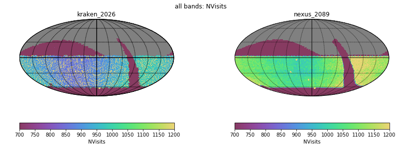
- [Nvisits alt/az all bands](figures/kraken_2026_nexus_2089_Nvisits_as_function_of_Alt_Az_all_bands_HEAL_ComboSkyMap.pdf)
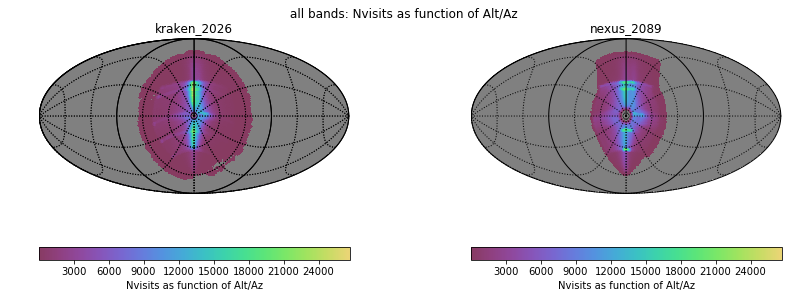
- [Median airmass all bands](figures/kraken_2026_nexus_2089_Median_airmass_all_bands_HEAL_ComboSkyMap.pdf)
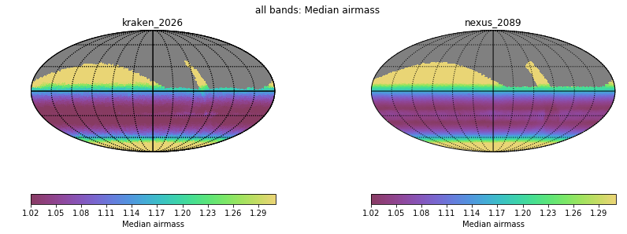
- [Max airmass all bands](figures/kraken_2026_nexus_2089_Max_airmass_all_bands_HEAL_ComboSkyMap.pdf)
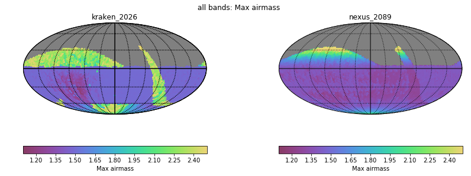
- [CoaddM5 r band](figures/kraken_2026_nexus_2089_CoaddM5_r_band_HEAL_ComboSkyMap.pdf)
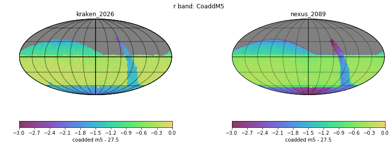
- [Normalized Proper Motion at 20.5](figures/kraken_2026_nexus_2089_Normalized_Proper_Motion_@_20_5_All_visits_HEAL_ComboSkyMap.pdf)
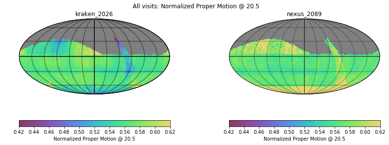
- [Normalized Parallax at 22.4](figures/kraken_2026_nexus_2089_Normalized_Parallax_@_22_4_All_visits_HEAL_ComboSkyMap.pdf)
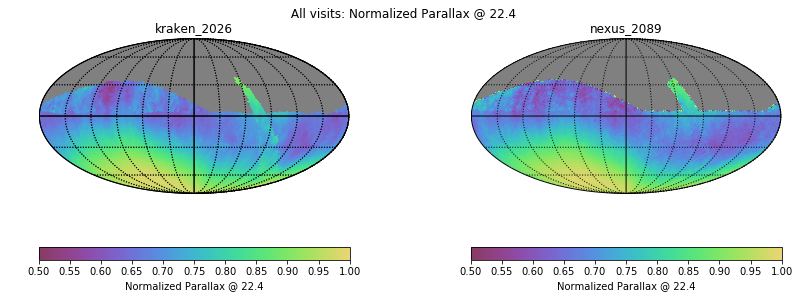
# Histrogram comparisons
### CoaddM5 r band HealPix Histrogram
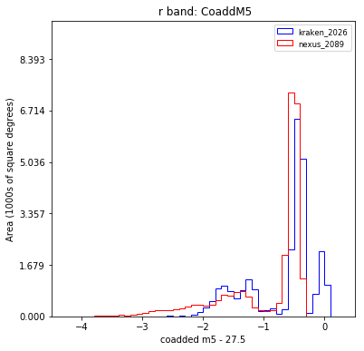
### Slew Distance Histogram
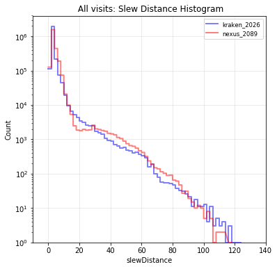
### Zoom Slew Distance Histogram
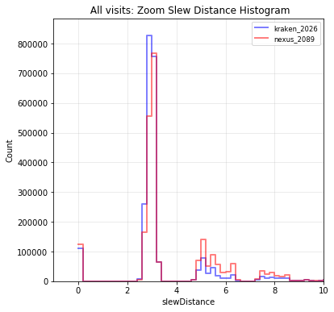
### Slew Time Histogram
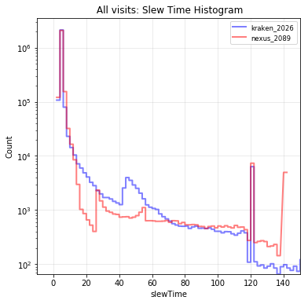
### Zoom Slew Time Histogram 
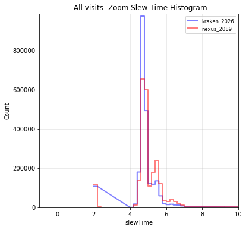
